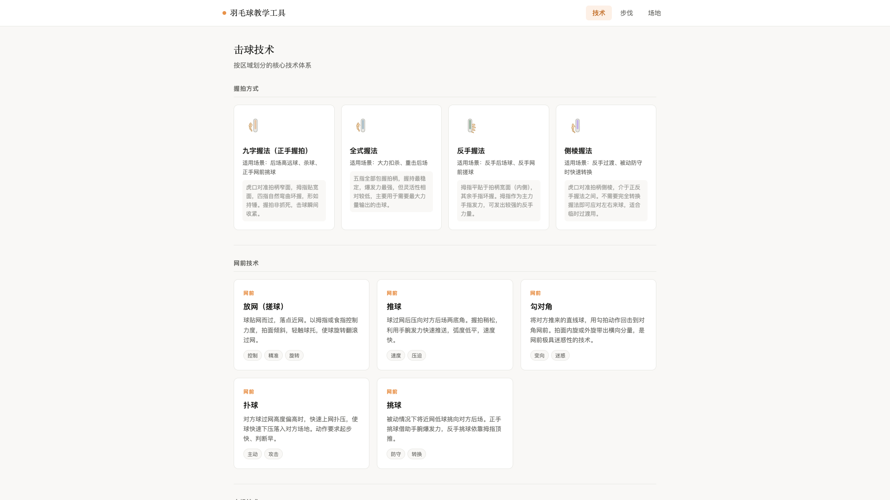
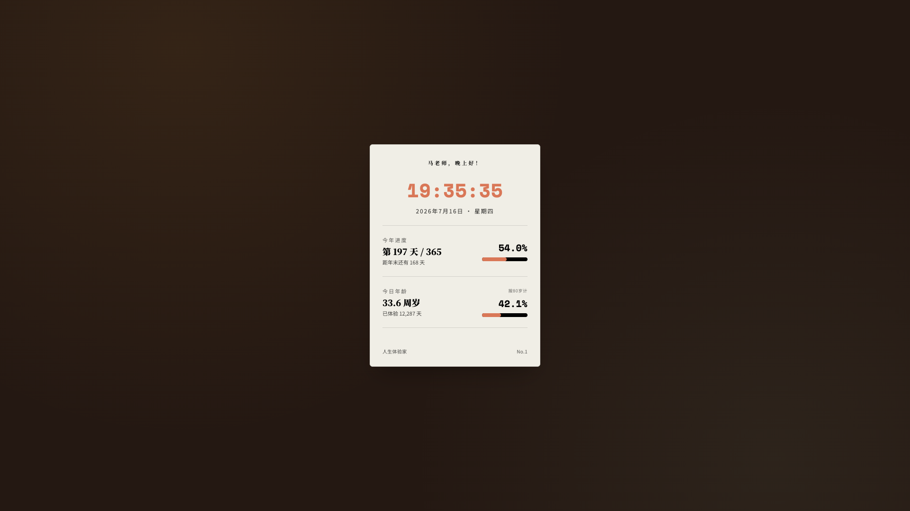
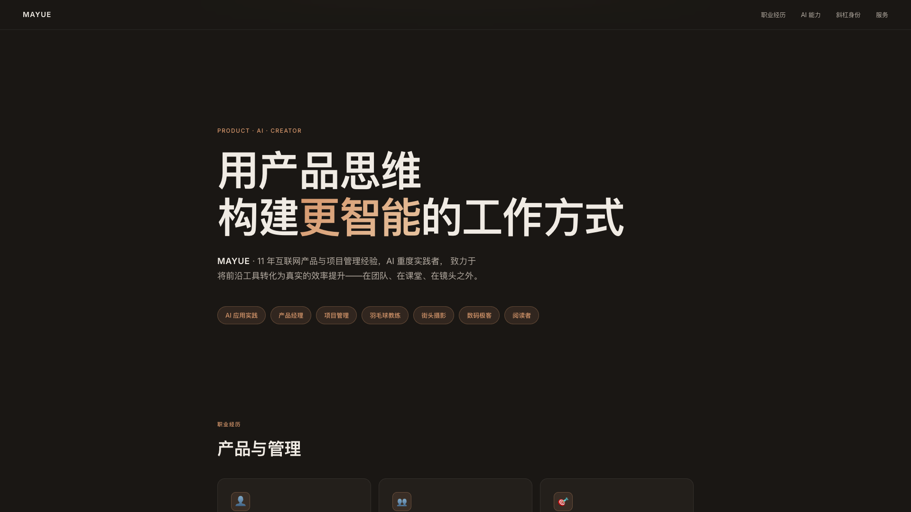
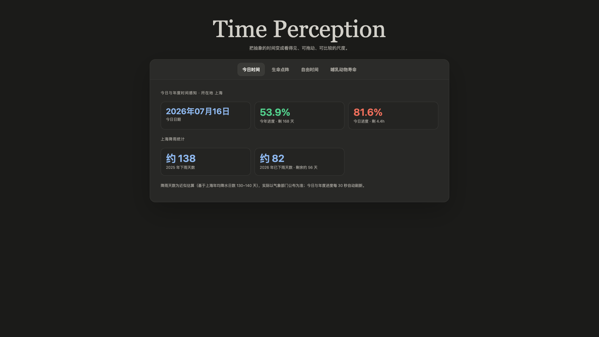
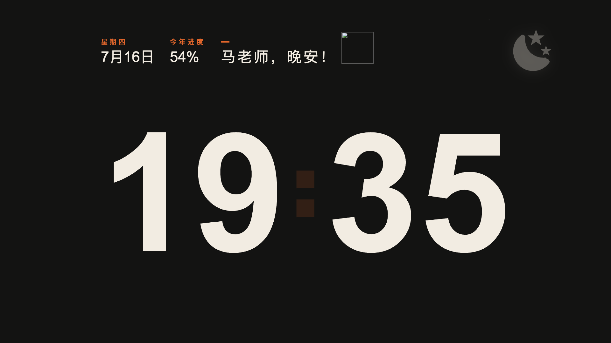
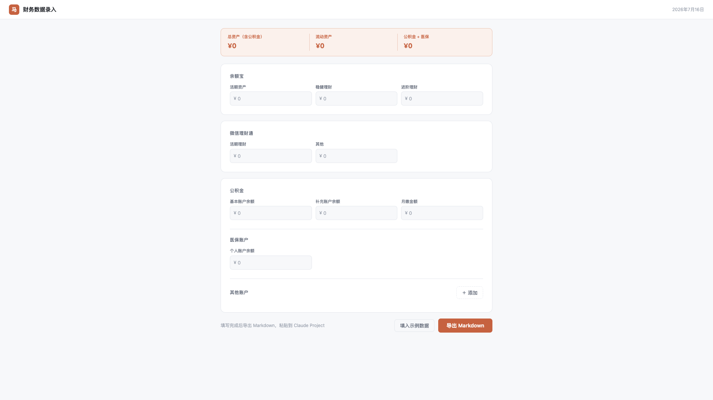
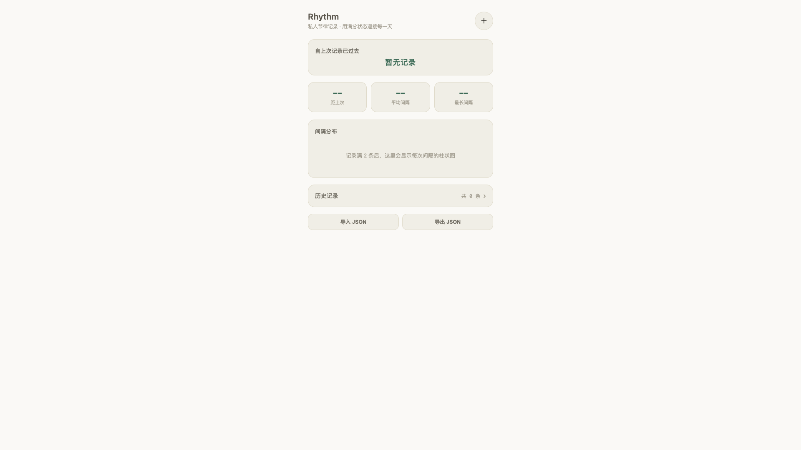

# mayue

个人开发的一些效率工具，以 HTML 为主。

## 产品列表

### 1. 羽毛球教学工具（badminton-coach）

羽毛球教学辅助工具。

### 2. 人生进度（life-card）

可视化展示人生进度，提醒时间宝贵。

### 3. 马老师的个人介绍（personal-page）

个人主页展示。

### 4. 时间感知器（time-perception）

时间感知与可视化工具。

### 5. TV Clock（tv-clock）

TV 端时钟显示。

### 6. 财务数据录入（wealth-tracker）

财务数据录入与追踪工具。

### 7. Rhythm（rhythm）

节奏工具。

